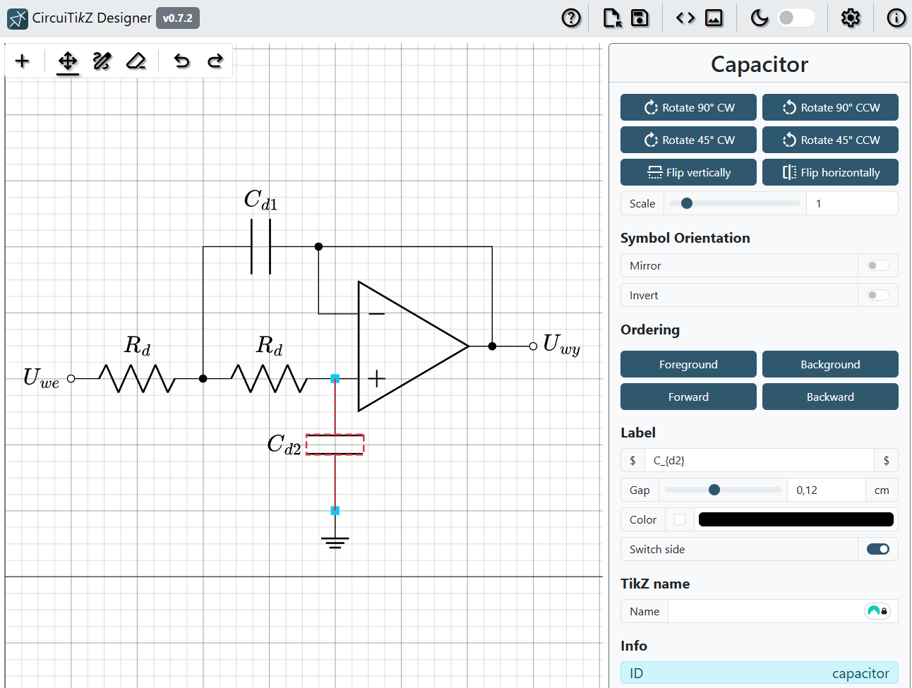
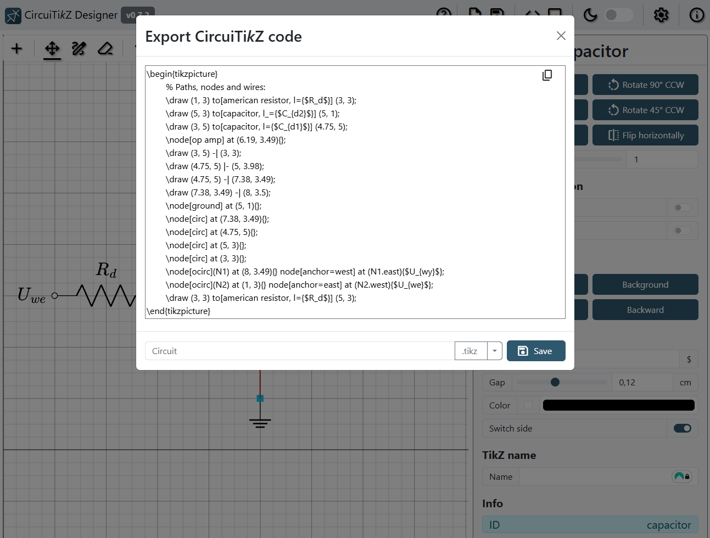
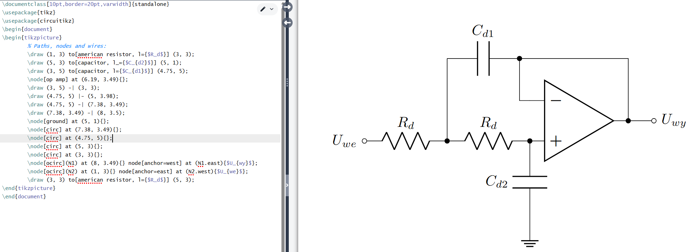

# CircuiTi*k*Z-Designer

An interactive, visual, online editor for creating electrical circuit diagrams for LaTeX/CircuiTi*k*Z with ease. Try it out [online](https://circuit2tikz.tf.fau.de/designer/)!

## Overview

CircuiTi*k*Z-Designer bridges the gap between visual circuit design and precise LaTeX code, letting you design, customize, and export diagrams without manually writing TikZ commands.
Whether you’re preparing academic papers, teaching materials, or engineering documentation, CircuiTi*k*Z-Designer provides:

- A clean, intuitive interface for fast diagram creation
- An extensive component library for all your circuit needs
- Real-time previews and instant export to high-quality LaTeX code

Stop wrestling with code syntax — focus on your circuit design, and let CircuiTikZ-Designer handle the Ti*k*Z.

|         Edit in CircuiTi*k*Z-Designer         |            Export to compilable Ti*k*Z code            |
| :-------------------------------------------: | :----------------------------------------------------: |
|  |  |

|               Use it in your LaTeX project!                |
| :--------------------------------------------------------: |
|  |

## Key Features

- **Visual Circuit Design:** Intuitive interface with multi-tab support and component grouping
- **Wide Component Library:** Includes most circuit elements plus some tikz components like rectangles, ellipses and arrows
- **Export Ready:** Generate clean LaTeX/TikZ code and compatible SVG exports for seamless document integration
- **Advanced Editing:** Rotate, scale, align, distribute, and snap components with clear visuals and flexible editing capabilities
- **Component Variants:** Easily switch between different versions of components and adjust their properties via the properties window
- **Cross-Platform Friendly:** Dark mode and mobile support for comfortable online editing anywhere
- **MathJax Support:** Write MathJax math expressions directly inside text components with real-time rendering

## Use locally

1. Have [Node.js](https://nodejs.org/) installed
2. Clone the repository
3. Run "npm install" in terminal in project directory
4. Run "npm start" in terminal in project directory
5. Open website at URL provided in command line output

## How to use

All controls of the application are explained in the help menu in the top right corner via the circled questionmark in the application itself.

If you need help, please use the [general discussions](https://github.com/Circuit2TikZ/CircuiTikZ-Designer/discussions/categories/general) page.

## Contributing

### Bug reporting

Please use the [issues page](https://github.com/Circuit2TikZ/CircuiTikZ-Designer/issues) of the project to report bugs. Please always provide steps on how to reproduce the bug.

### Feature requests

You can post feature requests and discuss them on the [discussions](https://github.com/Circuit2TikZ/CircuiTikZ-Designer/discussions/categories/ideas) page.

### Contribute code/component implementations

Fork the repo, and create a pull request. Please always test your code thoroughly!
