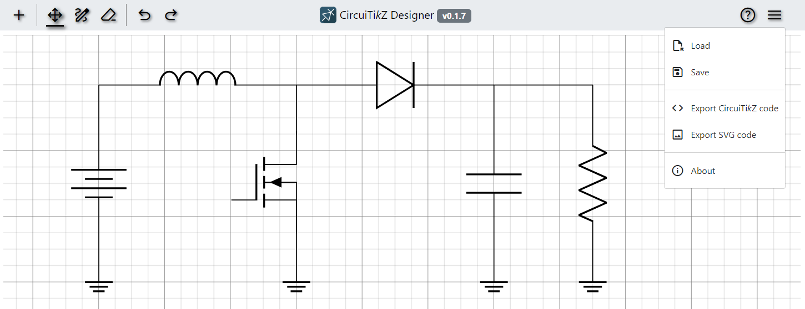
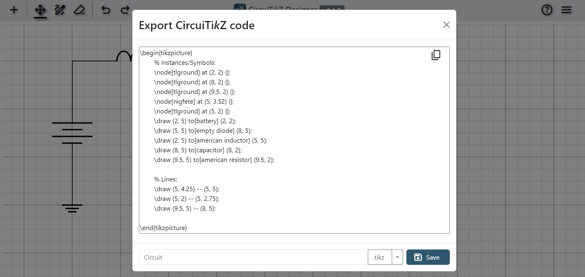

# CircuiTi<i>k</i>Z-Designer

A GUI for easy and fast drawing of circuits to be used with [circuitikz](https://github.com/circuitikz/circuitikz). Simply draw your circuit, export the CircuiTikZ code and paste it in your LaTeX document!

<b>Hosting of the tool is currently being worked on! Check back soon for more information!</b>
In the meantime you can use a previous version of the tool [here.](https://ussi.e-technik.uni-erlangen.de/tikz/)

## How to use

All controls of the application are explained in the help menu in the top right corner via the circled questionmark in the application itself.

## Export the circuit

You can export your circuit in multiple different formats:

- as CircuiTi<i>k</i>Z code to use in your LaTeX project.
- as SVG code to use almost anywhere.
- as a JSON for sharing and loading designs.

## Bugs and Features

Please use the [issues page](https://github.com/Circuit2TikZ/CircuiTikZ-Designer/issues) of the project to report bugs and suggest features. Please always provide steps on how to reproduce the bug.
